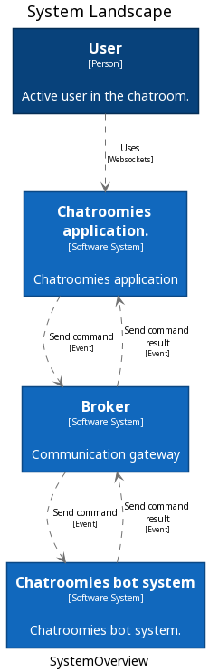
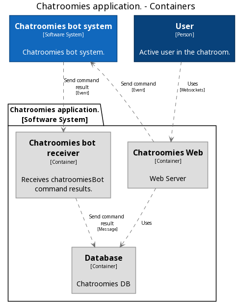

# Chatroomies


[](https://www.gnu.org/licenses/gpl-3.0)

A web-based chat system

Featuring:

- Stock quote bot in the chatrooms (just type /command=argument in the chat)
- Multiple chatrooms


## Table of Contents:


- [Installation](#installation)
- [Project Architecture](#architecture)
- [Contributing](#contributing)
- [Team](#team)
- [FAQ](#faq)
- [Support](#support)
- [License](#license)

---

## Installation:

### Requisites:
- Install [docker](https://www.docker.com/products/docker-desktop) and [docker-compose](https://docs.docker.com/compose/install/)


### Clone:

- Clone this repository:
	- ` git clone git@github.com:claudinoac/chatroomies`

### Setup:

- Run `make init`
- Wait until all the container are up and running


- Access [http://localhost:8080](http://localhost:8080')

- Log-in into the platform using default credentials or create another one on /login/signup endpoint
    - Default credentials - user:admin - password: admin

- Choose or create a new chat in the /chatroom endpoint (will be automatically redirected to after login or signup)
- Start chatting ! 

---

## Architecture Overview (C4 Model):

The architecture model was created using [Structurizr DSL](https://github.com/structurizr/dsl) and [PlantUML](https://plantuml.com)





## Testing:


### Unit tests:

- The unit tests are based on [Django test suite](https://docs.djangoproject.com/en/3.0/topics/testing/) and [PyTest]()
	
- All the unit tests will be in the `tests/unit` path, inside each application. 
- To run the unit tests, run 
	- ```$ make test unit```

---

## Contributing

> To get started...

### Step 1

- **Option 1**
    - 🍴 Fork this repo!

- **Option 2**
    - 👯 Clone this repo to your local machine using `https://github.com/claudinoac/chatroomies.git`

### Step 2

- **HACK AWAY!** 🔨🔨🔨

### Step 3

- 🔃 Create a new pull request using <a href="https://github.com/claudinoac/chatroomies/compare/" target="_blank">`https://github.com/claudinoac/chatrommies/compare/`</a>.

---

## Team

### Maintainers:
| <a href="http://github.com/claudinoac" target="_blank">**Alisson Claudino**</a>|
| :---: |
| [](http://fvcproductions.com)  |
| <a href="http://github.com/fvcproductions" target="_blank">`github.com/claudinoac`</a> |

### Contributors:
---

## FAQ

- **How can I can do ...?**
    - Response will be here

---

## Support

Reach out to me at one of the following places!

- Twitter at <a href="http://twitter.com/_claudinoac" target="_blank">`@_claudinoac`</a>

---

## License

- **[GNU GPLv3](https://www.gnu.org/licenses/gpl-3.0.en.html)**

